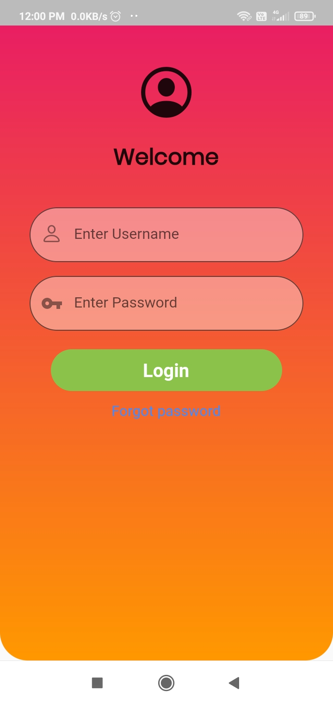
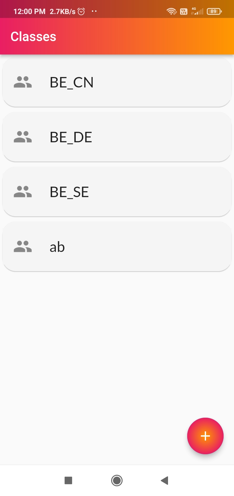
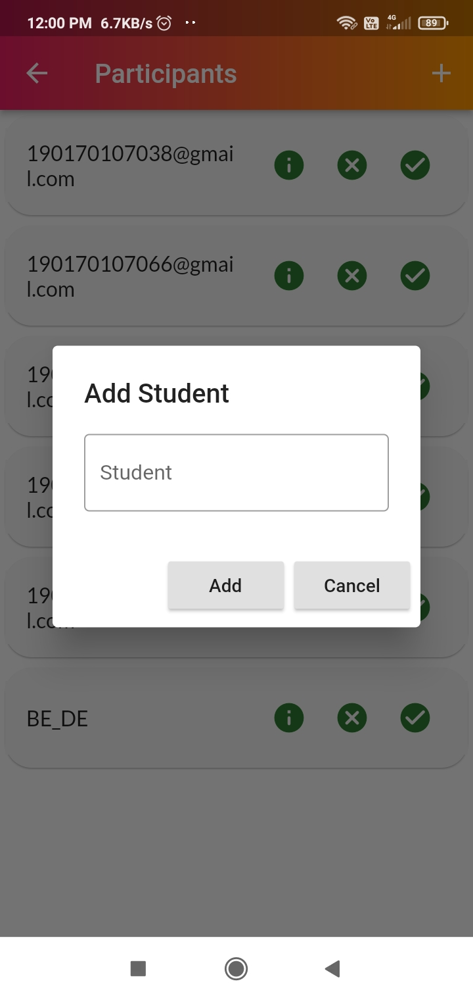
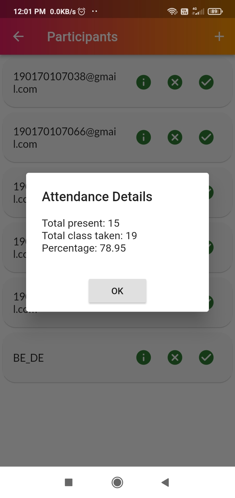

# Student Attendancs System

It is flutter application created using firebase for authentication. Using this application faculties can create channel of subject and add students to this channel. And kepp record of number of present, absent and percentages of attendance.

You can download application by downloading "base.apk"

# Screenshots

  
  
  
  

